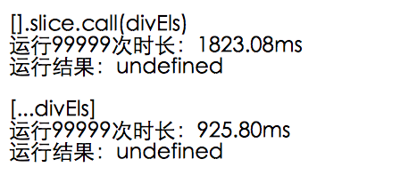

# 类数组->数组

```js
const likeArray = document.querySelectorAll('*');
const array = [].slice.call(likeArray);

// new
const array2 = [...likeArray];
```

- [性能对比](https://soneway.github.io/js/perf.html)

# 临时数组
```js
let html = '';
for (let i = 0, len = 10; i < len; i++) {
  html += `<div data-index="${i}"></div>`;
}

// new
const html2 = [...new Array(10)].map((_, i) => `<div data-index="${i}"></div>`).join('');
```

# :active
```scss
a:active {
    background: rgba(#000, 0.1);
}
```
> safari中不生效?
```html
<body ontouchstart></body>
```

# Script error.
- 跨域js中的报错,被浏览器拦截
### 解决办法
  1. js文件响应头添加: Access-Control-Allow-Origin:*
  1. script标签添加crossorigin="anonymous"
```html
<script crossorigin="anonymous" src="a.js"></script>
```
### 兼容性

# bind
```js
function foo(a, b) {
  console.log(a, b);
}
function bar(b) {
  foo(1, b);
}

// new
const bar2 = foo.bind(null, 1);
```
